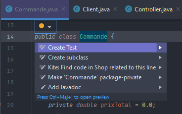
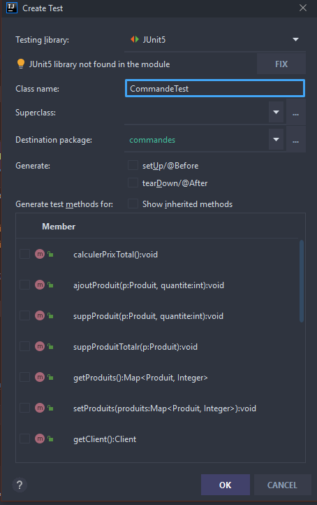
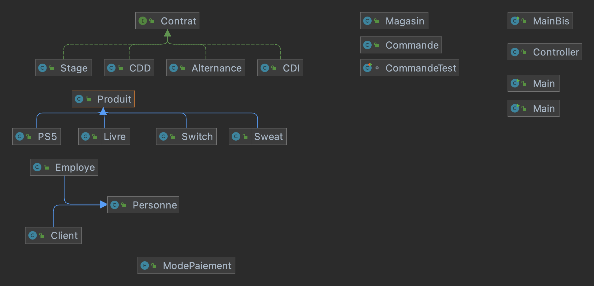

# MagasinJavaS5
 un projet de java réalisé par Simane AIT LAHCEN, Maxime BOURDON
 et Loïc Etienne
## Shop DAUPHINE : Programme en Java et interface en JavaFX  🌎 
 
>> Il s'agit d'un magasin qui vend des produits aléatoires dans lequel le client pourra interagir avec une interface graphique faite en JavaFX 

###Lien gitHub :
https://github.com/SimaneAL/Shop

### Installation 

#####1.IntelliJ : 
intelliJ IDEA 2021
#####2. JavaFX : 
truc

### Setup

Afin de pouvoir utiliser le JavaFX *********

Important ! 
>> Si vous n'avez jamais utilisé Junit sur Intellij vous devez suivre les étapes suivantes :
>

>Ensuite vous cliquez sur le boutton FIX en dessous de JUnit5
>

Voilà, il n'y a plus qu'une seule chose à faire, démarrer le programme en exécutant la classe MainBis

### 1. Java 

#### 1.1. Les Classes Métier : classes principales !
https://github.com/SimaneAL/Shop/tree/Simane_dev/src

#### 1.3. JavaFX !
https://github.com/SimaneAL/Shop/tree/Simane_dev/src/sample

### 1. Diagramme de classe :

